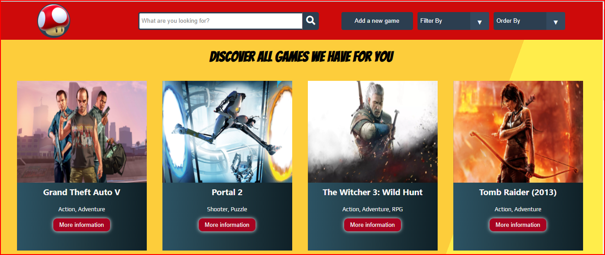
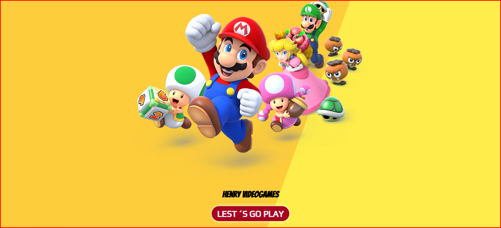

    

# Individual Project - Henry Videogames

  <!--  -->
  

 

## Project Objectives

- Build an App using React, Redux, Node and Sequelize.
- Affirm and connect the concepts learned in the race.
- Learn best practices.
- Learn and practice the GIT workflow.

#### Technologies:
- [X] React
- [X] Redux
- [X] Express
- [X] Sequelize - Postgres

#### Frontend

React / Redux application with the following screens / paths.

__Initial page__: landing page with
- [X] A background image representative of the project
- [X] Button to enter home (`Main route`)

__Main path__: contains
- [X] Search input to find video games by name
- [X] Area where the video game list will be seen. Shows his:
   - Picture
   - Name
   - Genders
- [X] Buttons / Options to filter by genre and by existing video game or added by us
- [X] Buttons / Options to sort the video games both in ascending and descending order in alphabetical order and by rating
- [X] Paged to go looking for and showing the following videogames

__Video Game Detail Path__: Contains
- [X] The fields shown in the main path for each video game (image, name, and genres)
- [X] Description
- [X] Release date
- [X] Rating
- [X] Platforms

__Video Game Creation Path__: Contains
- [X] A form __controlado__ with the following fields
   - Name
   - Description
   - Release date
   - Rating
- [X] Ability to select / add multiple genres
- [X] Possibility to select / add several platforms
- [X] Button / Option to create a new video game

#### Database

The database model has the following entities:

- [X] Video game with the following properties:
   - ID: * It cannot be an ID of an existing game in the rawg API
   - Name *
   - Description *
   - Release date
   - Rating
   - Platforms *
- [X] Genre with the following properties:
   - ID
   - Name
   - 
The relationship between both entities is many to many since a video game can belong to several genres simultaneously and, in turn, a genre can contain multiple different video games.

#### Backend

Development is server in Node / Express with the following paths:

- [X] __GET / videogames__:
   - Get a list of the first 15 video games
   - It should return only the data necessary for the main path
- [X] __GET /videogames?name="..."__:
   - Obtain a list of the first 15 video games that contain the word entered as query parameter
   - If there is no video game show a suitable message
- [X] __GET / videogame / {idVideogame} __:
   - Get the detail of a particular video game
   - You must bring only the data requested in the video game detail path
   - Include associated genres
- [X] __GET / genres__:
   - Get all types of video game genres possible
   - In the first instance, they must bring them from rawg and save them in their own database and then use them from there
- [X] __POST / videogame__:
   - Receive the data collected from the controlled form of the video game creation path by body
   - Create a video game in the database

  
  <!--  -->

 
